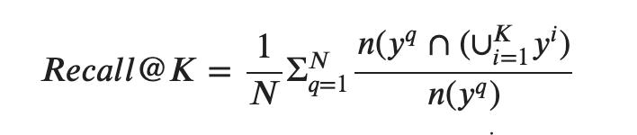

# Homework #2: Music Auto Tagging (Multi-Label Classification and Metric Learning Approach)[Colab Notebook](https://colab.research.google.com/drive/1ijCsGBbECCFbBtNmoR6Um8eLW2qUoxN9?usp=sharing)

Music auto-tagging is an important task that can be used in many musical applications such as music search or recommender systems. 

Two central methods for representation learning include deep metric learning and classification, both having the same goal of learning a representation that can generalize well across tasks.

Your mission is to build your own Neural Network model to represent audio signal. Specifically, the goals of this homework are as follows:

* Experiencing the whole pipeline of deep learning based system: data preparation, feature extraction, model training and evaluation
* Getting familiar with the Neural Network architectures for music representation
* Using Pytorch in practice

## Preparing The Dataset
We use the [magnatagatune](https://mirg.city.ac.uk/codeapps/the-magnatagatune-dataset) dataset which has been the most widely used in the music tagging task.  The MagnaTagATune dataset consists of 25k music
clips from 6,622 unique songs.

The dataset contains 30-second audio files including 189 different tags
For this homework, we are going to use a magnatagatune with 8-second audio and only 50 genres.

We use subset of magnatagatune dataset (9074 samples x 8 sec).
To make your life easier, place them in a directory as below:

```
%%capture
!wget http://mi.soi.city.ac.uk/datasets/magnatagatune/annotations_final.csv
!gdown --id 1f_kUF9nTLFI0pJaZxm6YNt4t_J6-Q-dg
!tar -xvf gct634.tar.gz
```

```
├── annotations_final.csv
├── waveform
  ├── 1
  ├── ...
  └── d
```

## Training CNNs from Scratch
The baseline code is provided so that you can easily start the homework and also compare with your own algorithm.
The baseline model extracts mel-spectrogram and has a simple set of CNN model that includes convolutional layer, batch normalization, maxpooling and fully-connected layer.

### Question 1: Implement a CNN based on a given model specification
An architecture of CNN will be provided. Implement a CNN following the architecture.

### Question 2: Improve the performenace. [Leader Board](https://docs.google.com/spreadsheets/d/1_tH-9c1JEgZjPumv6wFjAbBubTEKaP_eYtPZ95sCgcc/edit?usp=sharing)
Now it is your turn. You should improve the baseline code with your own algorithm. There are many ways to improve it. The followings are possible ideas: 

* You can try 1D CNN or 2D CNN models and choose different model parameters:
    * Filter size
    * Pooling size
    * Stride size 
    * Number of filters
    * Model depth
    * Regularization: L2/L1 and Dropout

* You should try different hyperparameters to train the model and optimizers:
    * Learning rate
    * Model depth
    * Optimizers: SGD (with Nesterov momentum), Adam, RMSProp, ...

* You can try training a model using both mel-spectrograms and features extracted using the pre-trained models. However, end-to-end training using additional external data is prohibited. (Performance doesn't have a huge impact on grading. don't waste time)


* You can try different parameters (e.g. hop and window size) to extract mel-spectrogram or different features as input to the network (e.g. MFCC, chroma features ...). 

* You can also use ResNet or other CNNs with skip connections. 

* Furthermore, you can augment data using digital audio effects.

### [Question 3] Implement the evaluation metric.
Implement a multi-label recall for metric learning. 
- https://arxiv.org/abs/2008.03729

If one of the top K retrieved results has the same class label as the query song, the recall@K is set to 1, otherwise it is set to 0. This process is repeated for all samples in the test set and then averaged. Our data is multi-labeled, however, so we adapt the standard single-label (multi-class) R@K metric to create a multi-label variant. Our definition is

<figure>

where $N$ is the number of test samples, $y^{q}$ is the ground truth labels of a query, and $y^{i}$ is the ground truth labels of the top $K$ retrieved results. And, $n(·)$ denotes the number of the elements of a set. In this setup, if the set of labels of the top K retrieved results contains all the multiple labels of the query song, the recall@K is set to 1, otherwise it is set to the correct answer ratio. We report R@K when K is 1, 2, 4, and 8.

### [Question 4] Improve the performenace. [Leader Board](https://docs.google.com/spreadsheets/d/1_tH-9c1JEgZjPumv6wFjAbBubTEKaP_eYtPZ95sCgcc/edit?usp=sharing)
Now it is your turn. You should improve the baseline code with your own algorithm. There are many ways to improve it. The followings are possible ideas: 

* Change backbone model
  - https://arxiv.org/abs/1609.04243
  - https://arxiv.org/abs/1711.02520
  - https://arxiv.org/abs/2006.00751
* Change distance mesure
  - Euclidean distance
  - Cosine distance
* Change positive negative sampling
  - Tag based sampling
  - Timbre, Beat based sampling
  - Latent Space based sampling (SVD or Word Embedding)
  - Instance based sampling

  
## Deliverables
You should submit your Python code (`.ipynb` or `.py` files) and homework report (.pdf file) to KLMS. The report should include:
* Algorithm Description
* Experiments and Results
* Discussion

## Note
The code is written using PyTorch but you can use TensorFlow if you want for question 3.

## Credit
Thie homework was implemented by Jongpil Lee, Soonbeom Choi and Taejun Kim in the KAIST Music and Audio Computing Lab.